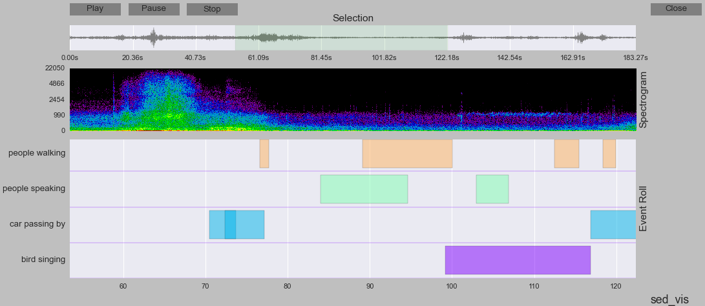

``sed_vis`` - Visualization toolbox for Sound Event Detection
=============================================================



``sed_vis`` is an open source Python toolbox for visualizing the annotations and system outputs of sound event detection systems.

There is an *event roll*-type of visualizer to show annotation and/or system output along with the audio signal. The audio signal can be played and indicator bar can be used to follow the sound events. 

The visualization tool can be used in any of the following ways:

* By using the included visualizer script directly. This is suitable users who do not normally use Python.
* By importing it and calling it from your own Python code

Installation instructions
=========================

You can install ``sed_vis`` from source by first installing the dependencies

``pip install -r requirements.txt``

and then running

``python setup.py install``

from the source directory.

Requirements
------------

* numpy >= 1.7.0
* scipy >= 0.9.0
* matplotlib >= 1.4.0
* pyaudio >= 0.2.7

Quickstart: Using the visualizer
================================

The easiest way to visualize sound events with ``sed_vis`` is to use provided visualizer script.

Visualizers are Python scripts which can be run from the command prompt and utilize ``sed_vis`` to visualize reference and estimated annotations you provide. 
To use the visualizers, you must first install ``sed_vis`` and its dependencies.
The visualizers scripts can be found in the ``sed_vis`` repository in the ``visualizers`` folder:

https://github.com/TUT-ARG/sed_vis/tree/master/visualizers

Currently there is one visualizer available, which is visualizing events as *event roll*.

To get usage help:

``./sed_visualizer.py --help``

To visualize reference and estimated annotations along with audio:

``./sed_visualizer.py -a ../tests/data/a001.flac -l ../tests/data/a001.ann ../tests/data/a001_system_output.ann -n reference system``

Where argument ``-l ../tests/data/a001.ann ../tests/data/a001_system_output.ann`` gives list of event lists to be visualized and argument ``-n reference system`` gives name identifiers for them.

This will show window with three panels: 

1. Selector panel, use this to zoom in, zoom out by clicking 
2. Spectrogram or time domain panel
3. Event roll, event instances can be played back by clicking them

To visualize only reference annotation along with audio:

``./sed_visualizer.py -a ../tests/data/a001.flac -l ../tests/data/a001.ann -n reference``

To visualize only reference annotation along with audio using only time domain representations:

``./sed_visualizer.py -a ../tests/data/a001.flac -l ../tests/data/a001.ann -n reference --time_domain``

To visualize only reference annotation along with audio, and merging events having only small gap between them (<100ms):

``./sed_visualizer.py -a ../tests/data/a001.flac -l ../tests/data/a001.ann -n reference --minimum_event_gap=0.1``

Quickstart: Using ``sed_vis`` in Python code
=============================================

After ``sed_vis`` is installed, it can be imported and used to your Python code as follows:

```python
import sed_vis

# Load audio signal first
audio, fs = sed_vis.io.load_audio('tests/data/a001.flac')

# Load event lists
reference_event_list = sed_vis.io.load_event_list('tests/data/a001.ann')
estimated_event_list = sed_vis.io.load_event_list('tests/data/a001_system_output.ann')
event_lists = {'reference': reference_event_list, 'estimated': estimated_event_list}

# Visualize the data
vis = sed_vis.visualization.EventListVisualizer(event_lists=event_lists,
                                                audio_signal=audio,
                                                sampling_rate=fs)
vis.show()
```

License
=======

Code released under [the MIT license](https://github.com/TUT-ARG/sed_vis/tree/master/LICENSE.txt). 